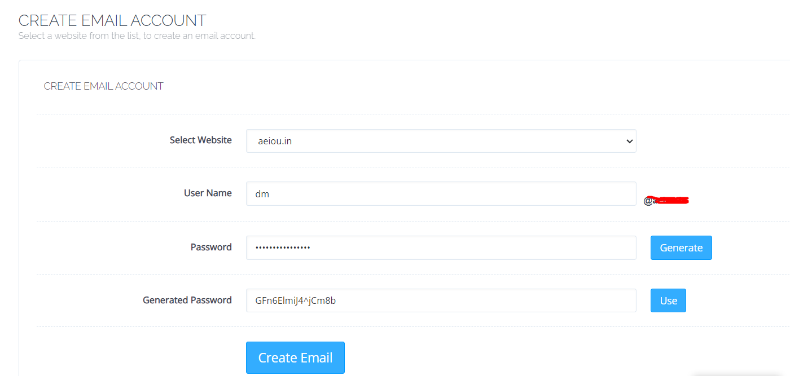

# Digital Marketing
### E-mail Marketing
- [ ] Create Business Email (Any Hosting Provider will give)
- [ ] Just Enter username and password follow the steps 
    
- [ ] Acess webmail or Addmail in gmail using Details to confighue mail clients such as POP3 IMAP SMTP (port, hostname, ssl refere here)
 
- [ ] Gmail--Settings--> Accounts and Import (TAB) --> Add an E-Mail Account --> after username -->port 110 to 995(ssl) hostname auto filled select 2,3rd options
   
- [ ] 

References
[Domain Mail To Gmail](https://support.google.com/mail/answer/6304825?ctx=gmail&hl=en-GB&authuser=0)
[Hostinger To Gmail](https://www.hostinger.in/tutorials/email/how-to-set-up-gmail-for-your-own-domain)
